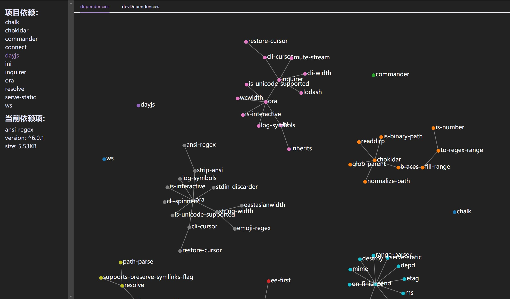

# 介绍
本项目仅为npm依赖包分析工具的前端展示部分。npm依赖包分析工具是一个根据node_modules包分析用户下载了什么依赖以及依赖下是否存在依赖等功能的CLI工具。
## 技术栈
Vue3+Vite+D3.js+Axios
## 项目亮点
使用D3绘制依赖关系图，通过Axios发送请求获取服务端返回的数据，返回数据为两个数组分别表示关系图的节点以及连接节点的线。再通过D3的语法分别绘制节点和线进同一个SVG容器中。
另外通过D3的drag函数实现了在容器内可随意拖动关系图，以及放大缩小的功能。
侧边栏处默认显示项目的依赖包，当点击单个节点的时候，通过emits将请求到的信息发送到侧边栏组件中，侧边栏显示单个节点信息。
前端页面完成打包后放在服务端的public文件夹下，服务端使用命令行分析依赖包完成后自动打开页面，并使用了WebSocket实现了热更新。

## 预览

